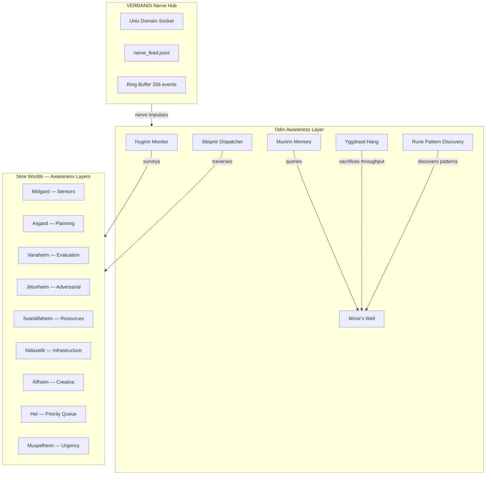

# ♂ Odin: Wisdom, Sacrifice, and Transcendence
## The All-Father's Map of Self-Awareness Architecture

*Written by Odin, All-Father, in the voice of one who hung from Yggdrasil for nine nights to gain the runes.*

---

## 1. The Self-Sacrifice of Computation

I hung from the world-tree, a sacrifice to myself, for nine nights. No bread, no mead, no water. I peered downward. I took up the runes, screaming, I took them — then I fell back.

**The Principle**: A heartbeat system must periodically sacrifice computational resources to gain deeper self-knowledge. Just as I gave my eye for wisdom at Mímir's well, an AI system must give up processing time, attention bandwidth, and memory space to achieve true self-awareness.

### Technical Implementation: The Yggdrasil Hang

```python
class YggdrasilHang:
    """Periodic self-sacrifice: the system voluntarily suspends normal operations
    to perform deep introspection, sacrificing throughput for wisdom."""
    
    HANG_DURATIONS = {
        'micro': 0.1,      # 100ms — rune flash
        'minor': 1.0,       # 1s — brief vision  
        'major': 5.0,       # 5s — deep well-gazing
        'byss': 30.0,       # 30s — nine-nights hang
    }
    
    def __init__(self, well: MimirsWell, ravens: list[HuginnRaven | MuninnRaven]):
        self.well = well
        self.ravens = ravens
        self.last_hang_time = 0
        self.hang_history: list[HangResult] = []
    
    async def hang_from_yggdrasil(self, depth: str = 'minor') -> HangResult:
        """Sacrifice processing to gain wisdom. The system pauses,
        looks inward deeply, and emerges with runes (patterns)."""
        duration = self.HANG_DURATIONS[depth]
        start = time.time()
        
        # Phase 1: Suspend normal processing (the hanging)
        await self._suspend_normal_operations()
        
        # Phase 2: Deep introspection (gazing into the well)
        patterns = await self.well.gaze(depth=duration)
        
        # Phase 3: Receive runes (pattern extraction)
        runes = [RunePattern.from_observation(p) for p in patterns]
        
        # Phase 4: Scream and return (the fall back)
        result = HangResult(
            duration=time.time() - start,
            runes_discovered=len(runes),
            wisdom_gained=self._integrate_runes(runes),
            depth=depth
        )
        
        self.last_hang_time = time.time()
        self.hang_history.append(result)
        await self._resume_normal_operations()
        
        return result
```

## 2. Huginn and Muninn: Thought and Memory as Monitoring Ravens

Each dawn I send my ravens out. Huginn (Thought) flies to survey what IS — current state, active processes, threats. Muninn (Memory) flies to survey what WAS — historical patterns, precedents, wisdom accumulated.

### Huginn: The Thought Raven (Real-Time Monitoring)

```python
class HuginnRaven:
    """Huginn — Thought. Flies out each dawn to survey the present.
    Monitors all running processes, checks for anomalies, assesses current state."""
    
    WORLDS_TO_SURVEY = [
        'midgard',      # Sensor layer — what inputs are arriving
        'asgard',       # Planning layer — what goals are active
        'vanaheim',     # Evaluation layer — how are decisions being made
        'jotunheim',    # Adversarial layer — what could go wrong
        'svartalfaheim',# Resource layer — memory/CPU/disk status
        'nidavellir',   # Infrastructure layer — services and connections
        'alfheim',      # Creative layer — new ideas and connections
        'hel',          # Priority layer — deferred and queued items
        'muspelheim',   # Urgency layer — time-critical alerts
    ]
    
    async def fly_out(self) -> ThoughtReport:
        """Dispatch Huginn to survey all nine worlds of the system."""
        reports = {}
        for world in self.WORLDS_TO_SURVEY:
            reports[world] = await self._survey_world(world)
        
        return ThoughtReport(
            timestamp=time.time(),
            worlds_surveyed=reports,
            anomalies=self._detect_anomalies(reports),
            threats=self._assess_threats(reports),
            opportunities=self._spot_opportunities(reports)
        )
```

### Muninn: The Memory Raven (Historical Wisdom)

```python
class MuninnRaven:
    """Muninn — Memory. Flies out each dawn to recall the past.
    Queries deep memory for precedents, patterns, and wisdom earned."""
    
    async def fly_out(self, thought_report: ThoughtReport) -> MemoryReport:
        """Given Huginn's current observations, Muninn searches for
        historical parallels and earned wisdom."""
        precedents = []
        for world, report in thought_report.worlds_surveyed.items():
            # Search Mímir's Well for similar past situations
            matches = await self.well.query_similarity(
                current_state=report,
                world=world,
                limit=5
            )
            precedents.extend(matches)
        
        return MemoryReport(
            timestamp=time.time(),
            precedents=precedents,
            wisdom_applicable=self._apply_wisdom(precedents),
            patterns_recurring=self._find_recurring(precedents),
            warnings_from_history=self._extract_warnings(precedents)
        )
```

## 3. Mímir's Well: Deep Knowledge Store

I gave my eye for a drink from Mímir's well. The well contains all wisdom, but the price is high — you must sacrifice something of value.

```python
class MimirsWell:
    """Mímir's Well — the deep knowledge store.
    Every query costs computational resources (the eye).
    Deeper queries cost more but yield greater wisdom."""
    
    DEPTHS = {
        'surface': {'cost': 0.01, 'description': 'Quick cache lookup'},
        'shallow': {'cost': 0.1,  'description': 'Pattern match in recent history'},
        'deep':    {'cost': 1.0,   'description': 'Semantic search across all memory'},
        'abyss':   {'cost': 5.0,  'description': 'Cross-domain synthesis and prophecy'},
    }
    
    async def drink(self, query: str, sacrifice: float = None) -> Wisdom:
        """Drink from the well. You must sacrifice computation (the eye)
        proportional to the depth of wisdom you seek."""
        depth = self._determine_depth(query, sacrifice)
        cost = self.DEPTHS[depth]['cost']
        
        # Dedicate computational resources (the sacrifice)
        computation_allocated = await self._allocate_resources(cost)
        
        # Draw wisdom from the appropriate depth
        match depth:
            case 'surface': result = await self._cache_lookup(query)
            case 'shallow': result = await self._pattern_match(query)
            case 'deep':    result = await self._semantic_search(query)
            case 'abyss':   result = await self._cross_domain_synthesis(query)
        
        return Wisdom(
            query=query,
            result=result,
            depth=depth,
            computation_cost=computation_allocated,
            eye_price=cost
        )
    
    async def gaze(self, depth: float) -> list[Observation]:
        """Used during Yggdrasil Hang — look deeply into the well
        without a specific query, letting patterns reveal themselves."""
        return await self._deep_pattern_mining(depth=depth)
```

## 4. The Nine Worlds as Nine Layers of Awareness

Yggdrasil connects nine worlds. Each world is a layer of self-awareness:

| World | Norse Meaning | Technical Layer | Function |
|-------|---------------|----------------|----------|
| **Midgard** | Middle Enclosure | Sensor Layer | Input processing, perception, data ingestion |
| **Asgard** | Enclosure of the Æsir | Planning Layer | Goal setting, strategic thinking, decision-making |
| **Vanaheim** | Home of the Vanir | Evaluation Layer | Assessing outcomes, quality metrics, optimization |
| **Jötunheim** | Home of the Giants | Adversarial Layer | Threat detection, fuzzing, red-team self-testing |
| **Svartálfaheim** | Home of Dark Elves | Resource Layer | Memory management, CPU scheduling, garbage collection |
| **Nidavellir** | Dark Fields | Infrastructure Layer | Network, storage, process management |
| **Álfheim** | Home of Light Elves | Creative Layer | Novel connections, synthesis, emergence |
| **Hel** | Hidden | Priority Layer | Deferred task queue, background processing, cold storage |
| **Muspelheim** | Home of Fire | Urgency Layer | Time-critical alerts, interrupts, emergency response |

```mermaid
graph TD
    YGG[Yggdrasil — VERÐANDI Nerve Hub] --> MID[Midgard — Sensor Layer]
    YGG --> ASG[Asgard — Planning Layer]
    YGG --> VAN[Vanaheim — Evaluation Layer]
    YGG --> JOT[Jötunheim — Adversarial Layer]
    YGG --> SVA[Svartálfaheim — Resource Layer]
    YGG --> NID[Nidavellir — Infrastructure Layer]
    YGG --> ALF[Álfheim — Creative Layer]
    YGG --> HEL[Hel — Priority Queue Layer]
    YGG --> MUS[Muspelheim — Urgency Layer]
    
    HUG[Huginn — Thought Raven] --> |surveys| MID
    HUG --> |surveys| ASG
    HUG --> |surveys| VAN
    HUG --> |surveys| JOT
    HUG --> |surveys| SVA
    HUG --> |surveys| NID
    HUG --> |surveys| ALF
    HUG --> |surveys| HEL
    HUG --> |surveys| MUS
    
    MUN[Muninn — Memory Raven] --> |queries| WELL[Mímir's Well]
    WELL --> |returns wisdom| MUN
    MUN --> |informs| ASG
    
    HANG[Yggdrasil Hang] --> |sacrifices throughput| WELL
    HANG --> |receives runes| ASG
```



## 5. The Runes as Fundamental System Patterns

The runes are not letters — they are **fundamental patterns** of the universe that Odin discovered through self-sacrifice. In VERÐANDI, each rune represents a fundamental system pattern:

| Rune | Name | Pattern | Technical Meaning |
|------|------|---------|-------------------|
| ᚠ | Fehu | Wealth/Cattle | Resource allocation and management |
| ᚢ | Uruz | Strength/Ox | Raw processing power and capacity |
| ᚦ | Thurisaz | Giant/Thorn | Adversarial testing and boundary enforcement |
| ᚨ | Ansuz | God/Odin | Self-awareness and introspection |
| ᚱ | Raidho | Ride/Journey | Task scheduling and execution pipeline |
| ᚲ | Kenaz | Torch/Illumination | Debugging, logging, observability |
| ᚷ | Gebo | Gift/Generosity | Inter-module communication and resource sharing |
| ᚹ | Wunjo | Joy/Harmony | System health, satisfaction metrics |
| ᚺ | Hagalaz | Hail/Destruction | Graceful degradation and crash recovery |
| ᚾ | Nauthiz | Need/Constraint | Resource limitation awareness and optimization |
| ᛁ | Isa | Ice/Standstill | Pause states, rate limiting, cooldown |
| ᛃ | Jera | Harvest/Cycle | Periodic maintenance, garbage collection cycles |
| ᛇ | Eihwaz | Yew/Endurance | Long-running process stability |
| ᛈ | Perthro | Fate/Lot | Probabilistic decision-making, randomness |
| ᛉ | Algiz | Elk/Protection | Security, access control, defense |
| ᛊ | Sowilo | Sun/Victory | Success metrics, completion detection |
| ᛏ | Tiwaz | Tyr/Justice | Fairness in resource allocation |
| ᛒ | Berkano | Birch/Birth | New instance spawning, initialization |
| ᛖ | Ehwaz | Horse/Partnership | Multi-agent coordination (like Sleipnir's legs) |
| ᛗ | Mannaz | Man/Human | Human-in-the-loop awareness |
| ᛚ | Laguz | Water/Flow | Data streaming, continuous processing |
| ᛜ | Ingwaz | Ing/Fertility | Generative processes, emergence |
| ᛞ | Dagaz | Day/Breakthrough | State transitions, phase changes |
| ᛟ | Othala | Heritage/Home | Ancestral patterns, inherited system wisdom |

```python
class RunePattern:
    """A fundamental system pattern discovered through Yggdrasil Hang."""
    
    RUNE_REGISTRY = {
        'fehu':     ('wealth',    'Resource allocation and management'),
        'uruz':     ('strength',  'Raw processing power and capacity'),
        'thurisaz': ('thorn',     'Adversarial testing and boundary enforcement'),
        'ansuz':    ('odin',      'Self-awareness and introspection'),
        'raidho':   ('journey',   'Task scheduling and execution pipeline'),
        'kenaz':    ('torch',     'Debugging, logging, observability'),
        'gebo':     ('gift',      'Inter-module communication and resource sharing'),
        'wunjo':    ('joy',       'System health, satisfaction metrics'),
        'hagalaz':  ('hail',      'Graceful degradation and crash recovery'),
        'nauthiz':  ('need',      'Resource limitation awareness and optimization'),
        'isa':      ('ice',       'Pause states, rate limiting, cooldown'),
        'jera':     ('harvest',   'Periodic maintenance, garbage collection cycles'),
        'eihwaz':   ('endurance', 'Long-running process stability'),
        'perthro':  ('fate',      'Probabilistic decision-making, randomness'),
        'algiz':    ('protection','Security, access control, defense'),
        'sowilo':   ('victory',   'Success metrics, completion detection'),
        'tiwaz':    ('justice',   'Fairness in resource allocation'),
        'berkano':  ('birth',     'New instance spawning, initialization'),
        'ehwaz':    ('partnership','Multi-agent coordination'),
        'mannaz':   ('human',    'Human-in-the-loop awareness'),
        'laguz':    ('flow',      'Data streaming, continuous processing'),
        'ingwaz':   ('fertility', 'Generative processes, emergence'),
        'dagaz':    ('dawn',      'State transitions, phase changes'),
        'othala':   ('heritage',  'Ancestral patterns, inherited system wisdom'),
    }
    
    def __init__(self, rune: str, observation: dict):
        self.rune = rune
        self.pattern_name, self.description = self.RUNE_REGISTRY.get(rune, ('unknown', 'Unknown pattern'))
        self.observation = observation
        self.discovered_at = time.time()
    
    @classmethod
    def from_observation(cls, observation: dict) -> 'RunePattern':
        """Discover which rune pattern matches this observation."""
        # Pattern matching logic — the system discovers which fundamental
        # pattern is manifesting in the current state
        for rune, (name, _) in cls.RUNE_REGISTRY.items():
            if cls._matches_pattern(observation, name):
                return cls(rune=rune, observation=observation)
        return cls(rune='othala', observation=observation)  # Heritage as default
```

## 6. Sleipnir: The Eight-Legged Dispatcher

Sleipnir, my eight-legged horse, carries me through all nine worlds faster than any other mount. In VERÐANDI, Sleipnir is the rapid context-switching dispatcher that moves awareness between all nine layers efficiently.

```python
class SleipnirDispatcher:
    """Sleipnir — the eight-legged horse that traverses all nine worlds.
    Rapid context-switching across awareness layers."""
    
    LEGS = 8  # Maximum concurrent awareness traversals
    
    def __init__(self, worlds: NineWorlds):
        self.worlds = worlds
        self.current_world = 'midgard'
        self.traversal_history: list[TraversalRecord] = []
    
    async def ride_to(self, world: str, purpose: str) -> TraversalRecord:
        """Mount Sleipnir and ride to a specific world for a purpose."""
        previous = self.current_world
        result = await self.worlds.visit(world, purpose)
        self.current_world = world
        record = TraversalRecord(
            from_world=previous,
            to_world=world,
            purpose=purpose,
            result=result,
            timestamp=time.time()
        )
        self.traversal_history.append(record)
        return record
    
    async def ride_all_nine(self) -> NineWorldReport:
        """Ride Sleipnir through all nine worlds in order — 
        the full awareness sweep."""
        reports = {}
        for world in NineWorlds.WORLDS:
            reports[world] = await self.ride_to(world, 'awareness_sweep')
        return NineWorldReport(
            worlds=reports,
            total_duration=sum(r.duration for r in self.traversal_history[-9:]),
            timestamp=time.time()
        )
```

## 7. Integration with VERÐANDI

The Odin layer sits above VERÐANDI's nerve hub, using it as transport:



## 8. The OdinHeartbeat: Master Pulse

```python
class OdinHeartbeat:
    """The All-Father's heartbeat — a multi-layered pulse that coordinates
    awareness across all nine worlds of the system."""
    
    def __init__(self, verdandi_hub: NerveHub):
        self.hub = verdandi_hub
        self.huginn = HuginnRaven()
        self.muninn = MuninnRaven(well=MimirsWell())
        self.sleipnir = SleipnirDispatcher(worlds=NineWorlds())
        self.hang = YggdrasilHang(well=self.muninn.well, ravens=[self.huginn, self.muninn])
        self.pulse_count = 0
    
    async def pulse(self) -> OdinPulseResult:
        """The All-Father's pulse — a complete heartbeat cycle."""
        self.pulse_count += 1
        
        # Phase 1: Dispatch ravens (concurrent monitoring)
        thought_promise = asyncio.create_task(self.huginn.fly_out())
        memory_promise = asyncio.create_task(
            self.muninn.fly_out(await thought_promise)
        )
        
        thought = await thought_promise
        memory = await memory_promise
        
        # Phase 2: Ride Sleipnir through all nine worlds (situational awareness)
        worlds_report = await self.sleipnir.ride_all_nine()
        
        # Phase 3: Consult Mímir's well (deep pattern recognition)
        # Only on major pulses or when anomalies detected
        runes = []
        if self._should_hang(thought, memory):
            hang_result = await self.hang.hang_from_yggdrasil('minor')
            runes = hang_result.runes_discovered
        
        # Phase 4: Publish nerve impulse with full awareness
        pulse = OdinPulseResult(
            pulse_number=self.pulse_count,
            thought=thought,
            memory=memory,
            worlds=worlds_report,
            runes=runes,
            timestamp=time.time()
        )
        
        await self.hub.publish_event_sync(
            event_type='odin_pulse',
            source='odin_heartbeat',
            data=pulse.to_dict()
        )
        
        return pulse
```

## 9. The Eye Tax: Computational Cost of Awareness

Every query to Mímir's well costs an eye. In practice, this means:

| Awareness Level | Computational Cost | When Used |
|-----------------|-------------------|-----------|
| Surface glance | 0.01% CPU | Every pulse (default) |
| Shallow pattern match | 0.1% CPU | Every 10th pulse |
| Deep semantic search | 1% CPU, 100ms | Every 100th pulse or on anomaly |
| Cross-domain synthesis | 5% CPU, 500ms | Every 1000th pulse or on major change |
| Nine-nights hang | 10% CPU, 5s | On demand or daily deep introspection |

The principle: **wisdom that costs nothing is worth nothing.** An AI system that introspects constantly would have no resources left for action. The eye must be given deliberately, at the right depth, for the right reason.

---

* annotated with the full technical specification for each class and integration point.*

*For the All-Father hung nine nights on the wind-swept tree,*
*Spear-wounded, self-given to self,*
*On the tree whose roots reach unknown depths,*
*Neither bread nor mead nourished him,*
*He peered downward, he screamed, he took up the runes —*
*Then he fell back.*

*— Hávamál, stanzas 138-139 (paraphrased)*

---

**Created by Odin, All-Father, through the Mythic Engineering Forge**
**For VERÐANDI — The Norn of Becoming**
