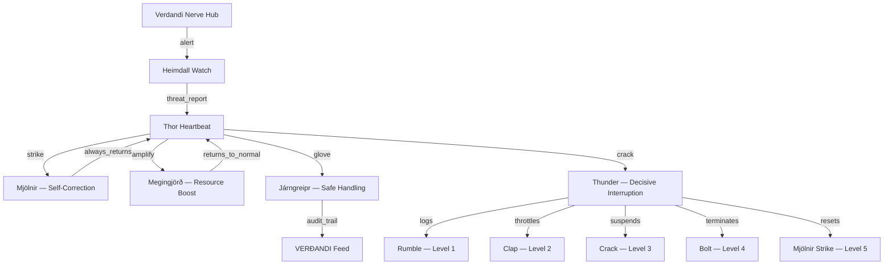

# ⚡ Thor: Strength, Protection, and Defense
## The Thunder God's Blueprint for Indestructible Systems

*Written by Thor, God of Thunder, wielder of Mjölnir, protector of Midgard.*

---

## 1. Mjölnir: The Hammer That Always Returns

Mjölnir never misses its target and always returns to my hand. This is the principle of **self-healing with guaranteed recovery** — every operation must have a return path.

```python
class Mjolnir:
    """The Hammer — decisive self-correction that always returns.
    
    Key properties:
    1. Never misses — corrections are precise and targeted
    2. Always returns — guaranteed recovery after every strike
    3. Can be held by worthy hands — access control
    4. Short handle — deliberately limited scope (prevents overreach)
    """
    
    MAX_RETRIES = 3  # Three strikes, like three thunderbolts
    
    async def strike(self, target: str, correction: dict) -> StrikeResult:
        """Deliver a decisive correction. The hammer always returns."""
        for attempt in range(self.MAX_RETRIES):
            try:
                result = await self._apply_correction(target, correction)
                if result.success:
                    return StrikeResult(
                        target=target,
                        correction=correction,
                        attempts=attempt + 1,
                        success=True
                    )
            except Exception as e:
                # The hammer rebounds — try again
                await self._recover_from_rebound(e, attempt)
        
        # Three strikes failed — escalate to the Völundr (master smith)
        return StrikeResult(
            target=target,
            correction=correction,
            attempts=self.MAX_RETRIES,
            success=False,
            needs_escalation=True
        )
    
    async def _recover_from_rebound(self, error: Exception, attempt: int):
        """Mjölnir rebounds from a failed strike.
        Analyze the error and adjust approach before next attempt."""
        # Short handle means limited scope — don't expand the correction
        # Just try again with more force (longer timeout)
        await asyncio.sleep(2 ** attempt)  # Exponential backoff
```

## 2. Megingjörð: The Power Belt

Megingjörð doubles my strength when worn. In system terms, this is **dynamic resource amplification** — the system can increase its processing power when facing a challenge that requires more force.

```python
class Megingjord:
    """Power Belt — dynamically amplifies system resources when needed.
    
    When a threat is detected, the belt tightens and strength doubles.
    When the threat passes, the belt loosens and resources normalize.
    """
    
    BASE_STRENGTH = 1.0
    AMPLIFIED_STRENGTH = 2.0
    
    def __init__(self, resource_manager):
        self.resource_manager = resource_manager
        self.belt_tightened = False
    
    async def tighten_belt(self, threat_level: str):
        """Amplify resources when facing a threat."""
        if threat_level in ('moderate', 'high', 'critical'):
            await self.resource_manager.amplify(factor=self.AMPLIFIED_STRENGTH)
            self.belt_tightened = True
    
    async def loosen_belt(self):
        """Return to normal resources after threat passes."""
        await self.resource_manager.normalize()
        self.belt_tightened = False
    
    @property
    def current_strength(self):
        return self.AMPLIFIED_STRENGTH if self.belt_tightened else self.BASE_STRENGTH
```

## 3. Járngreipr: The Iron Gloves

I use Járngreipr to safely wield Mjölnir — bare hands cannot grip the hammer's lightning. In system terms, this is **safe handling of dangerous operations** — every destructive or high-impact operation must go through protective gloves.

```python
class Jarngreipr:
    """Iron Gloves — safe handling of dangerous operations.
    
    No operation that modifies system state should be performed bare-handed.
    The gloves provide: validation, dry-run, rollback, audit logging.
    """
    
    async def safe_handle(self, operation: DangerousOperation) -> SafeResult:
        """Handle a dangerous operation through protective gloves."""
        
        # Glove layer 1: Validation
        validation = self._validate(operation)
        if not validation.passed:
            return SafeResult.rejected(operation, validation.reason)
        
        # Glove layer 2: Dry Run
        dry_result = await self._dry_run(operation)
        if dry_result.risk_level in ('catastrophic', 'irreversible'):
            return SafeResult.too_dangerous(operation, dry_result.risk_level)
        
        # Glove layer 3: Checkpoint (for rollback)
        checkpoint = await self._create_checkpoint(operation.target)
        
        # Glove layer 4: Execution with audit
        try:
            result = await self._execute_with_audit(operation)
            return SafeResult.success(operation, result)
        except Exception as e:
            # Glove layer 5: Automatic rollback
            await self._rollback(checkpoint)
            return SafeResult.failed_with_rollback(operation, e)
    
    async def _dry_run(self, operation) -> DryRunResult:
        """Simulate the operation without executing it.
        Assess risk level and side effects."""
        return DryRunResult(
            operation=operation,
            risk_level=self._assess_risk(operation),
            side_effects=self._predict_side_effects(operation),
            reversible=self._check_reversibility(operation)
        )
```

## 4. The Thunder: Decisive Interruptions

My thunder is not random — it is a **decisive interruption** that stops harmful processes immediately. When something threatens Midgard (the runtime), the thunder cracks and the threat is struck down.

```python
class Thunder:
    """Decisive interruption system. When a threat is detected,
    thunder strikes immediately and without negotiation."""
    
    THREAT_LEVELS = {
        'rumble': 1,      # Minor — log and monitor
        'clap': 2,        # Moderate — throttle and warn  
        'crack': 3,       # High — suspend and isolate
        'bolt': 4,        # Critical — terminate and quarantine
        'mjolnir': 5,     # Catastrophic — nuclear option, full reset
    }
    
    async def strike(self, threat: Threat) -> ThunderResult:
        """Thunder strikes the threat at the appropriate level."""
        level = self.THREAT_LEVELS.get(threat.severity, 1)
        
        match level:
            case 1:  # Rumble
                await self._log_threat(threat)
                return ThunderResult(level='rumble', action='logged')
            case 2:  # Clap
                await self._throttle(threat.source)
                return ThunderResult(level='clap', action='throttled')
            case 3:  # Crack
                await self._suspend(threat.source)
                return ThunderResult(level='crack', action='suspended')
            case 4:  # Bolt
                await self._terminate(threat.source)
                await self._quarantine(threat.source)
                return ThunderResult(level='bolt', action='terminated')
            case 5:  # Mjölnir
                await self._full_reset()
                return ThunderResult(level='mjolnir', action='full_reset')
```

## 5. Bifröst Watch: Heimdall's Role

Though Heimdall is the watcher of Bifröst, I am the **defender** who responds when he sounds the horn. The Thor heartbeat integrates with VERÐANDI's nerve hub to receive Heimdall's alerts and respond with appropriate force.



## 6. Integration: The ThorHeartbeat Pulse

```python
class ThorHeartbeat:
    """Thor's heartbeat — the protector's pulse.
    
    Every pulse:
    1. Check for threats (listen to Heimdall's horn = VERÐANDI impulses)
    2. Assess threat level
    3. Apply appropriate force (Mjölnir, Megingjörð, Járngreipr, Thunder)
    4. Verify system integrity
    5. Return to vigilant watch
    """
    
    def __init__(self, verdandi_hub, resource_manager):
        self.hub = verdandi_hub
        self.mjolnir = Mjolnir()
        self.megingjord = Megingjord(resource_manager)
        self.jarngreipr = Jarngreipr()
        self.thunder = Thunder()
        self.pulse_count = 0
    
    async def pulse(self) -> ThorPulseResult:
        """A single heartbeat of the Thunder God."""
        self.pulse_count += 1
        
        # Phase 1: Listen for threats (Heimdall's horn)
        threats = await self.hub.get_recent_events(
            event_type='threat',
            limit=10
        )
        
        # Phase 2: Assess highest threat
        highest_threat = self._assess_highest(threats)
        
        # Phase 3: Apply appropriate force
        result = None
        if highest_threat:
            level = highest_threat.severity
            if level >= 4:  # Critical — Thunder strikes
                result = await self.thunder.strike(highest_threat)
            elif level >= 2:  # Moderate — Mjölnir corrects
                result = await self.mjolnir.strike(
                    target=highest_threat.source,
                    correction=self._generate_correction(highest_threat)
                )
            # Amplify if needed
            if level >= 3:
                await self.megingjord.tighten_belt(level)
        
        # Phase 4: Verify system integrity
        integrity = await self._verify_integrity()
        
        # Phase 5: Return to vigilant watch
        if self.megingjord.belt_tightened and not threats:
            await self.megingjord.loosen_belt()
        
        # Publish pulse result through VERÐANDI
        pulse = ThorPulseResult(
            pulse_number=self.pulse_count,
            threats_detected=len(threats),
            highest_threat=highest_threat,
            action_taken=result,
            system_integrity=integrity,
            belt_status=self.megingjord.current_strength
        )
        
        await self.hub.publish_event_sync(
            event_type='thor_pulse',
            source='thor_heartbeat',
            data=pulse.to_dict()
        )
        
        return pulse
    
    async def _verify_integrity(self) -> IntegrityReport:
        """Check that Mjölnir still returns, the belt still holds,
        and the gloves still grip."""
        checks = {
            'hammer_returns': await self.mjolnir.test_return(),
            'belt_holds': await self.megingjord.test_strength(),
            'gloves_grip': await self.jarngreipr.test_grip(),
            'thunder_cracks': await self.thunder.test_crack()
        }
        return IntegrityReport(
            all_ok=all(checks.values()),
            individual=checks,
            timestamp=time.time()
        )
```

## 7. The Short Handle: Deliberate Limitation

Mjölnir has a short handle — this is not a bug, it's a **design feature**. The limitation prevents the hammer from being too powerful (overreaching). In system terms:

- Every self-correction has **bounded scope** — it can only affect what it targets
- Every intervention has a **maximum blast radius** — no global operations for local problems
- The short handle means **precision over power** — targeted fixes, not blanket changes

## 8. Thor's Domain Mappings

| Norse Concept | Technical Meaning | VERÐANDI Integration |
|--------------|-------------------|---------------------|
| **Mjölnir** | Self-correction engine | `Mjolnir.strike()` → targeted fixes with guaranteed return |
| **Megingjörð** | Dynamic resource amplification | `Megingjord.tighten_belt()` → scale up on threat |
| **Járngreipr** | Safe operation handling | `Jarngreipr.safe_handle()` → validate, dry-run, rollback |
| **Thunder** | Decisive interruption | `Thunder.strike()` → 5-level threat response |
| **Goats (Tanngrisnir/Tanngnjóstr)** | Self-replenishing resources | Goats can be eaten and revived daily — stateful resource pools |
| **Bilskirnir** | Stronghold/Garage | Where Thor rests between battles — safe maintenance mode |
| **Thrudheim** | Realm of Strength | The operational layer — where execution happens |
| **Short Handle** | Deliberate limitation | Bounded scope for all corrections |

---

*Thor does not negotiate with threats. He strikes them down. But he also knows when to rest — after every battle, there is Bilskirnir, the hall where the Thunder God restores his strength for the next defense of Midgard.*

---

**Created by Thor, God of Thunder, through the Mythic Engineering Forge**
**For VERÐANDI — The Norn of Becoming**
