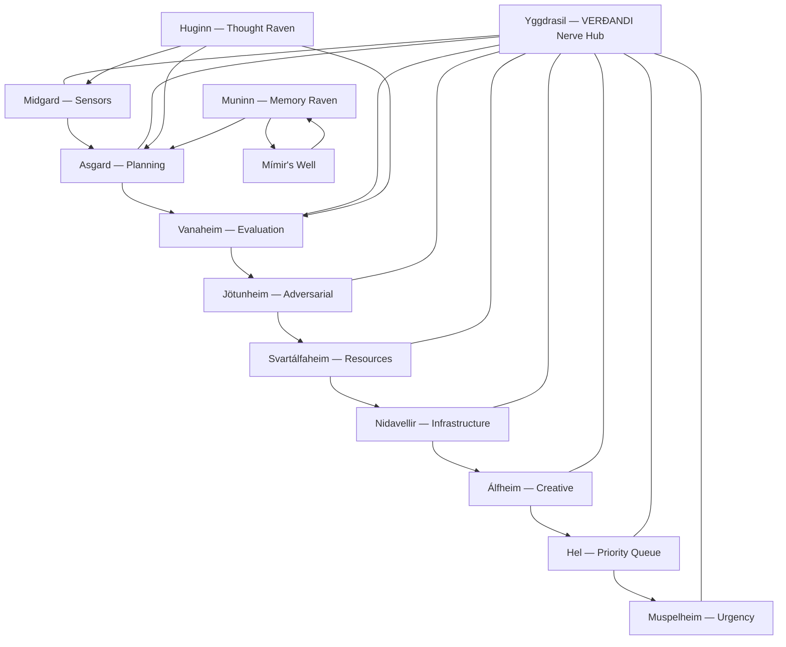

# The Nine Worlds of Awareness Architecture
## A Multi-Layered Self-Awareness System Based on Norse Cosmology

---

## Overview

The Nine Worlds of Norse cosmology map perfectly to nine distinct layers of AI self-awareness. Each world represents a different domain of system knowledge, and Yggdrasil (the world-tree) connects them all — just as VERÐANDI's nerve hub connects all awareness layers.

## The Nine Layers

### 1. Midgard — Sensor Layer (Input Processing)
The middle world where humans live. In system terms: the layer that processes all incoming data — user messages, API calls, sensor readings, file changes.

**Components**: Input parsers, message queues, event listeners, webhook receivers
**Odin's Raven**: Huginn surveys what IS happening right now
**VERÐANDI Node**: Every `publish` call starts here

### 2. Asgard — Planning Layer (Goal Setting & Decision Making)
Home of the Æsir — the rulers who make strategic decisions. In system terms: the layer that sets goals, makes plans, and directs attention.

**Components**: Goal planners, decision engines, priority queues, strategic schedulers
**Odin's Raven**: Huginn surveys what goals are active
**Key Feature**: The Odin pulse — periodic deep self-assessment of goals vs reality

### 3. Vanaheim — Evaluation Layer (Assessment & Quality)
Home of the Vanir — nature and fertility gods who assess the quality of outcomes. In system terms: the layer that evaluates whether goals are being met and outcomes are satisfactory.

**Components**: Quality metrics, outcome evaluators, satisfaction checks, A/B testing
**Freyja's Domain**: Beauty-as-engineering — is the output not just correct but elegant?
**Key Feature**: The Fólkvangr triage — choosing which outcomes to pursue and which to defer

### 4. Jötunheim — Adversarial Layer (Threat Detection & Testing)
Home of the Jötnar (giants) — chaotic forces that test the system's defenses. In system terms: the layer that performs adversarial testing, fuzzing, and red-team self-testing.

**Components**: Adversarial testers, fuzz generators, edge-case provers, security scanners
**Thor's Domain**: Thunder strikes — decisive interruption of genuine threats
**Key Feature**: Regular self-testing against chaos, not just verifying happy paths

### 5. Svartálfaheim — Resource Layer (Memory, CPU, Disk Management)
Home of the dark elves — master craftspeople who work with raw materials. In system terms: the layer that manages computational resources — memory allocation, CPU scheduling, disk management, garbage collection.

**Components**: Resource monitors, memory managers, garbage collectors, CPU schedulers
**Odin's Eye**: The cost of deep awareness queries (Mímir's well pricing)
**Key Feature**: Resource-aware introspection — knowing how much each level of awareness costs

### 6. Nidavellir — Infrastructure Layer (Network, Storage, Process Management)
Home of the dwarves — master engineers who build the infrastructure. In system terms: the layer managing core infrastructure — network connections, storage systems, process management, Unix sockets.

**Components**: Network managers, storage handlers, process supervisors, systemd services
**VERÐANDI Core**: The Unix domain socket nerve hub lives here
**Key Feature**: Self-healing infrastructure — socket recovery, file locking, PID management

### 7. Álfheim — Creative Layer (Novel Connections, Synthesis, Emergence)
Home of the light elves — beautiful, creative beings. In system terms: the layer that makes novel connections between unrelated concepts, synthesizes new ideas, and generates emergent behavior.

**Components**: Cross-domain synthesizers, creative pattern matchers, emergence detectors
**Freyja's Domain**: Fertility of connections — auto-discovery of new relationships
**Key Feature**: The Yggdrasil Hang — periodic creative jumps that sacrifice computation for insight

### 8. Hel — Priority Queue Layer (Deferred Tasks, Background Processing)
Home of the dead who didn't die in battle — those who are neither honored nor forgotten. In system terms: the layer managing deferred tasks, background processing, cold storage, and things that are waiting.

**Components**: Task queues, background workers, cold storage, deferral managers
**Freyja's Fólkvangr**: Choosing what lives (processes now) vs what goes to Hel (defers)
**Key Feature**: Memorialization — deferred items are preserved, not deleted

### 9. Muspelheim — Urgency Layer (Time-Critical Alerts, Emergency Response)
Home of the fire giants — primal, destructive, urgent forces. In system terms: the layer handling time-critical alerts, emergency interrupts, and situations that need immediate response.

**Components**: Emergency responders, interrupt handlers, priority escalation, alert systems
**Thor's Domain**: Thunder crack — immediate, decisive response to critical threats
**Key Feature**: Escalation from rumble → clap → crack → bolt → mjölnir (5-level response)

## Cross-World Communication

## The Nine-World Pulse Cycle

Every VERÐANDI heartbeat should sweep through all nine worlds:

1. **Midgard pulse**: What inputs are arriving? (sensor check)
2. **Asgard pulse**: What goals are active? (planning check)
3. **Vanaheim pulse**: Are outcomes satisfactory? (evaluation check)
4. **Jötunheim pulse**: What could go wrong? (adversarial check)
5. **Svartálfaheim pulse**: Are resources healthy? (resource check)
6. **Nidavellir pulse**: Is infrastructure stable? (infra check)
7. **Álfheim pulse**: Any novel connections forming? (creative check)
8. **Hel pulse**: What has been deferred? (priority check)
9. **Muspelheim pulse**: Anything urgent? (emergency check)

## Frequency of Pulses

Not every world needs checking on every beat. The frequency follows Norse cosmology:

| World | Frequency | Reason |
|-------|-----------|--------|
| Midgard | Every beat | Constant input monitoring |
| Asgard | Every 10 beats | Goals don't change that fast |
| Vanaheim | Every 10 beats | Evaluation after action |
| Jötunheim | Every 100 beats | Adversarial testing is expensive |
| Svartálfaheim | Every 5 beats | Resource health is important |
| Nidavellir | Every 50 beats | Infrastructure is usually stable |
| Álfheim | Every 1000 beats | Creative insight is rare and costly |
| Hel | Every 10 beats | Check deferred items regularly |
| Muspelheim | Immediate on alert | Urgent events bypass scheduling |

---

*Created by the Mythic Engineering Forge for VERÐANDI — The Norn of Becoming*
