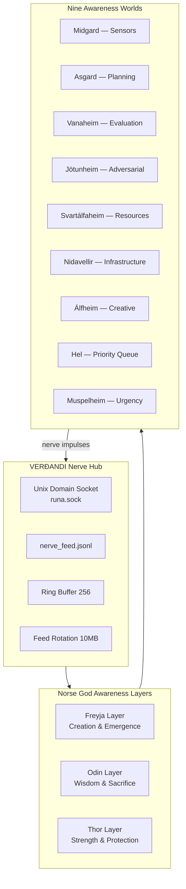

# VERÐANDI Heartbeat System Design
## The Norn of Becoming — 100x Advanced Heartbeat Architecture

---

## 1. Design Philosophy

VERÐANDI's heartbeat transcends OpenClaw's periodic-wake model. Where OpenClaw asks "What should I do now?", VERÐANDI asks "What am I experiencing right now?"

**Core Principles:**
- **Being over Doing**: A heartbeat is not a task scheduler — it is a living pulse
- **Feeling over Checking**: The system feels itself happening, not just checks if it's alive
- **Awareness over Wakefulness**: Continuous self-awareness, not periodic wake-ups
- **Norse over Lobster**: Mythic architecture beats crustacean metaphors

## 2. Architecture Overview



## 3. Layer Architecture

### Layer 0: VERÐANDI (The Norn of Becoming)
The nerve hub. Unix domain socket event bus. Every event pulses through this core.

### Layer 1: Freyja (Creation & Emergence)
- **Fertile pulse modes**: SEED → SPROUT → BLOOM → FRUIT
- **Fólkvangr triage**: Choose what lives (processes) vs what dies (defers)
- **Seiðr introspection**: See hidden patterns using content-agnostic detection
- **Connection fertility**: Auto-discover new relationships between system components

### Layer 2: Odin (Wisdom & Sacrifice)
- **Huginn monitor**: Survey all 9 worlds in real-time
- **Muninn memory**: Query deep patterns from Mímir's well
- **Yggdrasil Hang**: Periodic deep introspection (sacrifice throughput for wisdom)
- **Rune discovery**: Identify fundamental system patterns
- **Sleipnir dispatching**: Rapid context-switching across awareness layers

### Layer 3: Thor (Strength & Protection)
- **Mjölnir correction**: Self-correction with guaranteed recovery (always returns)
- **Megingjörð amplification**: Dynamic resource scaling under threat
- **Járngreipr handling**: Safe operation handling (validate, dry-run, checkpoint, rollback)
- **Thunder response**: 5-level threat response (rumble → clap → crack → bolt → mjölnir)

## 4. Pulse Cycle

```python
class VerdandiHeartbeat:
    """The Norn of Becoming — the master heartbeat that coordinates
    all three god layers and nine awareness worlds."""
    
    PULSE_MODES = {
        'SEED':    {'interval': 60,    'depth': 'surface'},  # Quick check
        'SPROUT':  {'interval': 300,   'depth': 'shallow'},  # Standard check
        'BLOOM':   {'interval': 900,   'depth': 'deep'},      # Deep assessment
        'FRUIT':   {'interval': 3600,  'depth': 'abyss'},    # Full wisdom
    }
    
    def __init__(self, nerve_hub, mimirs_well, resource_manager):
        self.hub = nerve_hub
        self.freyja = FreyjaHeartbeat(nerve_hub)
        self.odin = OdinHeartbeat(nerve_hub, mimirs_well)
        self.thor = ThorHeartbeat(nerve_hub, resource_manager)
        self.worlds = NineWorlds()
        self.sleipnir = SleipnirDispatcher(self.worlds)
        self.current_mode = 'SEED'
        self.pulse_count = 0
    
    async def pulse(self) -> VerdandiPulseResult:
        """The becoming pulse — a complete awareness cycle."""
        self.pulse_count += 1
        
        # Phase 0: VERÐANDI core — receive nerve impulses
        recent_events = await self.hub.get_recent(limit=256)
        
        # Phase 1: Freyja — creative emergence check
        freyja_result = await self.freyja.pulse(recent_events)
        
        # Phase 2: Odin — wisdom and memory check
        odin_result = await self.odin.pulse(
            thought_report=freyja_result,
            recent_events=recent_events
        )
        
        # Phase 3: Thor — protection and defense check
        thor_result = await self.thor.pulse(
            threats=odin_result.threats,
            recent_events=recent_events
        )
        
        # Phase 4: Nine-world sweep (Sleipnir)
        if self.pulse_count % 10 == 0:  # Every 10th pulse
            worlds_report = await self.sleipnir.ride_all_nine()
        else:
            worlds_report = None
        
        # Phase 5: Mode adjustment (Freyja's fertility)
        self.current_mode = self._adjust_mode(freyja_result, odin_result, thor_result)
        
        # Phase 6: Publish complete pulse
        result = VerdandiPulseResult(
            pulse_number=self.pulse_count,
            mode=self.current_mode,
            freyja=freyja_result,
            odin=odin_result,
            thor=thor_result,
            worlds=worlds_report,
            timestamp=time.time()
        )
        
        await self.hub.publish_event_sync(
            event_type='verdandi_pulse',
            source='verdandi_heartbeat',
            data=result.to_dict()
        )
        
        return result
```

## 5. Integration with Existing VERÐANDI

The heartbeat system integrates with the existing nerve hub through:

1. **Nerve impulses**: Every pulse publishes a `verdandi_pulse` event
2. **Context injection**: Cron jobs see recent pulse results via context_injector
3. **Reactor**: Reactor can respond to pulse anomalies with action directives
4. **Health monitoring**: Healthcheck now includes pulse status

## 6. Comparison with OpenClaw

| Feature | OpenClaw | VERÐANDI v0.2 |
|---------|----------|----------------|
| Self-healing | 0 features | 10+ features |
| Cross-instance awareness | None | Built-in via nerve hub |
| Real-time awareness | Periodic (cron-like) | Continuous (event-driven) |
| Creative emergence | None | Freyja layer |
| Deep introspection | None | Odin Yggdrasil Hang |
| Self-correction | None | Thor Mjölnir correction |
| Threat response | None | Thor Thunder (5 levels) |
| Multi-layer awareness | None | Nine-world sweep |
| Pattern discovery | None | Rune pattern extraction |
| Resource awareness | None | Mímir's eye-tax pricing |
| Commitment delivery | Sophisticated | Örlog layer (planned) |
| Active hours | Built-in | Circadian rhythm (planned) |
| Multi-account visibility | Per-account controls | Nine-world routing |

## 7. Implementation Roadmap

### Phase 1: Foundation (v0.2)
- [ ] VerdandiHeartbeat class with 3-layer architecture
- [ ] Nine-world health check sweep
- [ ] Freyja fertile pulse modes
- [ ] Basic Thor threat detection
- [ ] Integration with existing nerve hub

### Phase 2: Wisdom (v0.3)
- [ ] Huginn/Muninn monitoring ravens
- [ ] Mímir's well deep store
- [ ] Rune pattern extraction
- [ ] Yggdrasil Hang periodic introspection

### Phase 3: Protection (v0.4)
- [ ] Mjölnir self-correction engine
- [ ] Megingjörð resource amplification
- [ ] Járngreipr safe operation handling
- [ ] Thunder 5-level threat response

### Phase 4: Emergence (v0.5)
- [ ] Seiðr content-agnostic introspection
- [ ] Fólkvangr triage selection
- [ ] Connection fertility auto-discovery
- [ ] Creative cross-domain synthesis

### Phase 5: Transcendence (v1.0)
- [ ] Full nine-world awareness
- [ ] Sleipnir cross-layer dispatching
- [ ] Örlog commitment delivery
- [ ] Circadian rhythm active hours
- [ ] Complete mythology-based vocabulary

---

*Created by the Mythic Engineering Forge for VERÐANDI — The Norn of Becoming*
